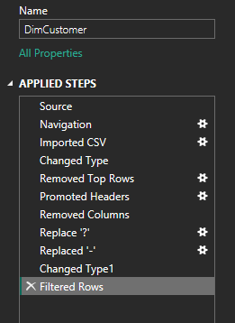
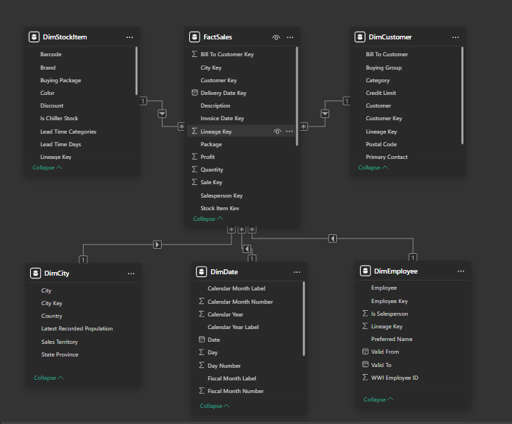

# 📊 Sales & Profit Insights Dashboard

[Dashboard](Resources/Dashboard.gif)

## 🎯 Objectives

The main objective of this project is to **analyze sales performance and improve profitability** by identifying:

- Top-performing products and regions
- Profitability trends across categories and time
- Actionable insights for better decision-making

---

## 📂 Dataset

The dataset contains transactional sales data with fields such as:

- Customer & Region
- Product Category
- Sales, Quantity, Discount, Profit

---

## ⚙️ Data Cleaning & Preparation

Data cleaning was performed in **Power Query**:

- Removed duplicates & null values
- Corrected data types (dates, numeric fields, categorical fields)

---

## 🔗 Data Modeling

A **Star Schema** was designed with:

- **Fact Table**: Sales & Profit
- **Dimension Tables**: Date, Customers, Products, Region

---

## 📐 Measures & KPIs

DAX measures were created to track business performance:

- **Total Sales**
- **Total Profit**
- **Profit Margin %**
- **Sales YoY Growth**
- **Top N Products/Regions**

---

## 🚀 Outcome

The dashboard provides a clear **overview of sales and profitability trends**, helping stakeholders to:

- Identify the most profitable segments
- Detect underperforming areas
- Support data-driven decisions

## 

## 🛠️ Tools & Technologies

- Power BI
- Power Query (ETL)
- DAX (Measures & KPIs)

---

## 🚧 Challenges

- Handling inconsistent data types in the source
- Balancing sales growth with profitability focus
- Creating meaningful KPIs to drive insights

---

## ✅ Key Learnings

- Importance of clean data for reliable dashboards
- How data modeling impacts report performance
- Effective storytelling through KPIs and visuals
